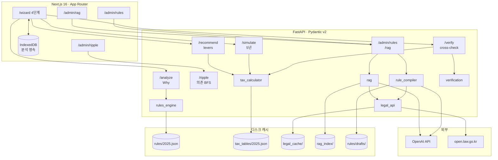

<div align="center">

# 🌟 SUSEMI — AI 기반 연말정산 WHY 리포트

### **기획 → 디자인 → 프론트 → 백엔드 → AI 분석 → 배포까지 4일 만에 단독 개발한 MVP**
### **그 위에 자체 세금 산식 · 룰 컴파일러 · 법령 RAG · 의존성 그래프까지 확장**


<br/>


<br/>


<br/><br/>

✨ **사용자 맞춤형 연말정산 "WHY" 리포트 — 숫자가 아니라 _이유_ 를 알려주는 도구**
✨ **PDF 파싱 → 세법 Rule Engine → AI 분석 → 자체 산식 cross-check → 5년 시뮬 → 추천**
✨ **모든 결정세액에 _법령 조항 ID + 적용 공식_ 이 따라옴 (Provenance trace)**

</div>

---

## 📌 프로젝트 요약

> **"왜 내 연말정산 환급액이 이렇게 나왔는지 알고 싶다."**
> 기존 간소화 서비스는 합계만 보여주고
> **"왜 이 결과가 나왔는지"는 설명해 주지 않습니다.**

**SUSEMI** 는 PDF + 사용자 입력 + 세법 룰 + 자체 세금 산식을 결합해
AI 가 **각 항목의 원인·법령 근거·계산 단계까지 풀어 쓴 WHY 리포트** 를 만듭니다.
회사가 신고한 결과와 단계별로 cross-check 까지 해줘서, 환급액이 새는 곳을 잡아내요.

---

## 🚀 무엇이 다른가

| | 일반적인 도구 | **SUSEMI** |
|---|---|---|
| 결과 | 환급액 숫자 | **숫자 + [rule_id] anchor + 적용 공식 + 단계 trail** |
| LLM 인용 | 자유 텍스트 (hallucination 위험) | **시스템이 제공한 룰만 인용 가능** + JSON 강제 |
| 산식 | 외부 의존 / 블랙박스 | **자체 정수(원 단위) 한국 소득세 계산기** + 회사 신고 cross-check |
| 룰 추가 | 코드 직접 수정 | **법령 본문 → LLM 컴파일 → 검수 큐 → production** |
| What-if | 정성적 권유 | **4 lever marginal effect ranking + 5년 누적 시뮬** |
| 의존 추적 | 없음 | **Ripple-Effect Simulator** — 변수 1개 변경 시 영향 BFS |

---

## ✨ 주요 기능

### ✔ AI Why 분석 엔진
- 단순 요약이 아닌 **원인 기반 Reasoning (Explainable AI)**
- Rule Engine 결과 + GPT 결합 → **수세미 말투**(친근 + 정확)
- 시스템이 평가한 룰만 인용 → **hallucination 차단**

### ✔ 국세청 PDF 자동 파싱 (Hybrid Pipeline)
한국 연말정산 간소화 PDF는 포맷이 일정하지 않아 정규식만으로 한계.
SUSEMI 의 **Hybrid Parsing**:

```
PDF Binary
  → PyMuPDF 텍스트 추출
  → GPT 기반 텍스트 분석 + JSON 구조화
  → Pydantic 후처리/타입 정제
  → ParsedPdfData + missing_fields 반환
```

→ 포맷이 살짝 달라도 LLM 이 문맥으로 흡수
→ 누락 항목을 `missing_fields` 로 자동 추천
→ Pydantic 으로 응답 안정성 확보

### ✔ 자체 세금 산식 (한국 소득세 풀 파이프라인)
**총급여 → 근로소득공제 → 인적공제 → 과세표준 → 누진세율 → 세액공제 → 결정세액 → 지방소득세 → 환급/추징**

- 정수(원 단위), 부동소수점 누적 오차 회피
- 모든 단계가 `CalcStep`(legal_anchor + formula + inputs + output)으로 trail
- 세율표·공제율은 100% 외부 JSON (`tax_tables/2025.json`)
- **골든셋 5케이스 + 단위 27케이스** 통과

### ✔ 회사 신고와 단계별 cross-check
원천징수영수증의 결정세액·기납부세액을 입력하면 자체 산식 결과와 단계별로 비교.
- severity 4단계 (`match` / `minor` <1,000원 반올림 / `major` / `missing`)
- 단정 표현 금지 — `"오류"` 대신 `"확인 필요"` 톤
- 환급액이 더 받을 수 있으면 emerald, 추징이면 red

### ✔ 5년 What-if 시뮬레이션
- 인상률 % + 결혼/자녀 시점 입력 → 연도별 환급/추징 + 누적
- `YearOverride` carry-forward — 첫 해만 바꿔도 5년 자동 상속
- 결혼·자녀 같은 life event 시점부터 자동 적용

### ✔ Greedy 추천 (What-if 4 lever)
- **연금저축 400만 / IRP 합산 700만 / 정치자금 10만 / 월세 세액공제** marginal effect ranking
- 자격 검사 (월세는 세대주 ∧ 무주택 ∧ 임대차)
- `cost_label` 로 비용 명시 — delta 만으로 오해하지 않게

### ✔ 법령 RAG (admin)
- 국가법령정보센터 OPEN API 에서 본문 fetch (소득세법 1,511 청크 검증)
- `text-embedding-3-small` + 디스크 per-law 저장 + cosine top-K
- **빈 인덱스/필터 → 임베딩 호출 자동 skip** (비용·안정성)

### ✔ LLM 룰 컴파일러 + 검수 큐 (admin)
- 법령 본문 → LLM → Rule JSON
- 메타 강제 덮어쓰기 (LLM 이 rule_id/anchor 변경 못 함)
- 화이트리스트 검증 + confidence 디스카운트
- 드래프트 → 검수자 approve → `rules/{year}.json` 병합

### ✔ Ripple-Effect Simulator (admin)
- 룰 evaluator 자동 분석 + tax_calculator step DAG 정적 매핑
- 입력 필드 1개 선택 → 영향받는 룰·단계를 BFS depth 별로 시각화
- "causal" 명명 회피 — **결정론적 정적 분석** 임을 명시

### ✔ 카카오페이톤 감성 UI
- 브랜드 컬러 `#FACC15` (CTA·highlight 전용) + slate-900 신뢰 톤
- **4단계 Wizard UX** + 결과 페이지 펼침 섹션 3개 (verify / recommend / simulate)
- PC: 좌측 위저드 / 우측 sticky 리포트 패널
- 모바일: step<4 위저드만, step=4 리포트만 (스크롤 한 번)
- 모든 Input/Card/UploadArea **직접 커스텀** + lucide-react 아이콘

### ✔ 단 4일 만에 단독 개발한 MVP, 그 위에 v2 확장
기획 → 디자인 → 프론트 → 백엔드 → AI 분석 → 배포까지
**100% 혼자 4일 만에 MVP** 를 만들고, 이후 자체 산식 / 검증 / 시뮬 / RAG / 룰 컴파일러까지 단독 확장.

---

## 🔧 시스템 아키텍처



---

## 🧠 핵심 모듈

| 영역 | 위치 | 핵심 |
|---|---|---|
| 환급액 산식 | `server/app/services/tax_calculator.py` | 정수 한국 소득세. 모든 단계 `CalcStep` trail. 골든셋 5+단위 27 |
| 룰 엔진 | `server/app/services/rules_engine.py` | JSON 룰 + Pydantic discriminated union. **`eval()` 사용 0줄** |
| 법령 API | `server/app/services/legal_api.py` | open.law.go.kr 클라이언트 + 디스크 캐시 + sha256 변경 감지 |
| 룰 컴파일러 | `server/app/services/rule_compiler.py` | 법령 → LLM → Rule JSON. 메타 강제 + 화이트리스트 검증 |
| RAG | `server/app/services/rag.py` | text-embedding-3-small + per-law + cosine + 임베딩 비용 최적화 |
| 검증 | `server/app/services/verification.py` | tax_calc vs 회사 신고 단계별 diff. 단정 표현 금지 톤 |
| 시뮬 | `server/app/services/simulate.py` | YearOverride carry-forward → 매년 tax_calc 재실행 |
| 추천 | `server/app/services/recommend.py` | 4 lever marginal ranking + 자격 검사 |
| Ripple | `server/app/services/dependencies.py` | 룰·step 정적 의존 그래프 + BFS |

---

## 📊 진행도

| Phase | 내용 | 상태 |
|:---:|---|:---:|
| 1 | UI 리디자인 (slate + yellow) | ✅ |
| 2-1 | 환급액 산식 + 골든셋 | ✅ |
| 2-2 | 룰 JSON 외부화 | ✅ |
| 2-3 | IndexedDB 클라 영속 | ✅ |
| 2-4 | 법령 API 클라이언트 | ✅ |
| 3-1 | Provenance trace | ✅ |
| 3-2 | LLM 룰 컴파일러 + 검수 | ✅ |
| 3-3 | 회사 신고 cross-check | ✅ |
| 4-1 | 다년도 What-if 시뮬 | ✅ |
| 4-2 | 단순 RAG | ✅ |
| 4-3 | Greedy 추천 | ✅ |
| 4-4 | 의존성 그래프 (ripple) | ✅ |
| 5 | WASM / ILP / KG / FL | 트리거 시 |

자세한 단계별 작업 로그: **[PLAN.md](./PLAN.md)** · 코드 패턴 / 컨텍스트: **[CLAUDE.md](./CLAUDE.md)**

---

## 🔐 보안

직접 PoC 로 검증한 후 차단:

- ✅ **Path traversal 차단** — `rule_id`, `law_id` 등 파일명 컴포넌트 화이트리스트 (`^[A-Za-z0-9_\-]+$`). PoC 로 base 디렉터리 탈출 가능했던 것 fix.
- ✅ **`eval()` 사용 0줄** — 룰 evaluator 는 Pydantic discriminated union 으로 분기.
- ✅ **시크릿 분리** — `.env*` gitignore + `.env.example` 만 화이트리스트 (실키 절대 커밋 X).
- ✅ **LLM hallucination 차단** — 시스템이 제공한 `[rule_id]` anchor 만 인용 허용.
- ✅ **민감 데이터 서버 영속화 안 함** — 분석 결과는 클라이언트 IndexedDB 만.
- ⚠️ **Admin 인증 미구현** — 운영 배포 전 토큰 가드 필수.

---

## 🧪 테스트

```bash
cd server && source venv/bin/activate
pytest tests/ -q
```

```
145 passed in 1.7s
```

| 모듈 | 케이스 |
|---|:---:|
| legal_api | 11 |
| tax_calculator | 27 |
| rules_engine | 19 |
| provenance | 5 |
| rule_compiler | 12 |
| rule_drafts_store | 16 |
| verification | 8 |
| simulate | 9 |
| rag | 14 |
| recommend | 9 |
| dependencies | 14 |
| **합계** | **145** |

골든셋(국세청 모의계산기 동치성 검증), discriminated union 파싱, BFS 최단경로, path traversal 차단, mocked LLM/임베더, MockTransport 기반 법령 API 시뮬 모두 포함.

---

## 📦 실행 방법

### 1. 환경변수
```bash
cp .env.example .env
# .env 에 OPENAI_API_KEY, OPEN_LAW_API_KEY (open.law.go.kr OC) 채우기
```

### 2. Backend (FastAPI)
```bash
cd server
python -m venv venv && source venv/bin/activate
pip install -r requirements.txt
uvicorn main:app --reload    # → http://localhost:8000
```

### 3. Frontend (Next.js 16)
```bash
cd client
npm install
npm run dev                  # → http://localhost:3000 (자동 /wizard)
```

---

## 📡 API 요약

| Method | Path | 역할 |
|---|---|---|
| POST | `/api/v1/pdf-parse` | PDF Hybrid Parsing |
| POST | `/api/v1/analyze` | Rule Engine + LLM Why 분석 |
| POST | `/api/v1/verify` | 자체 산식 vs 회사 신고 단계별 cross-check |
| POST | `/api/v1/simulate` | 5년 What-if 시뮬레이션 |
| POST | `/api/v1/recommend` | 4 lever marginal effect ranking |
| GET | `/api/v1/ripple/{field}` | 입력 변경 시 영향받는 룰·단계 BFS |
| GET | `/api/v1/ripple/graph` | 전체 의존성 그래프 |
| POST | `/api/v1/rag/index` | 법령 청크 임베딩 |
| POST | `/api/v1/rag/search` | 자연어 → top-K 청크 |
| POST | `/api/v1/admin/rules/compile` | 법령 → LLM 룰 JSON 드래프트 |
| GET/POST | `/api/v1/admin/rules/drafts/...` | 드래프트 검수 (approve/reject) |

---

## 🛠 기술 스택

### Frontend
- **Next.js 16** (App Router) · React 19 · Tailwind CSS v4
- TypeScript 5 strict · ESLint 9
- `lucide-react` 아이콘 · IndexedDB 직접 사용 (의존성 0)
- 반응형 Wizard + Admin UI 모두 자체 컴포넌트

### Backend
- **FastAPI 0.121** · Uvicorn · **Pydantic v2** (discriminated union, ge/pattern 검증)
- `httpx` async · `openai` 2.x SDK · `PyMuPDF`
- **`pytest` + `pytest-asyncio`** (asyncio_mode=auto)
- AWS EC2 배포 + 세법 Rule Engine 자체 구현

### External
- **OpenAI**: `gpt-4o-mini` (분석/룰 컴파일) + `text-embedding-3-small` (RAG)
- **국가법령정보센터 OPEN API**: 법령 본문 + 시행일자 변경 감지

---

## 🏆 Technical Highlights

- **한국 간소화 PDF → GPT 기반 Hybrid Parsing** 직접 구현 (정규식 한계 회피)
- 자체 한국 소득세 풀 산식 (정수 기반, 골든셋 검증)
- **Provenance trace** — 모든 결정세액에 법령 anchor + 공식 + 단계 trail
- LLM 룰 컴파일러 + human-in-the-loop 검수 큐 (메타 강제 덮어쓰기)
- 법령 API 디스크 캐시 + sha256 변경 감지 → 자동 재컴파일 트리거 가능
- 단순 RAG (text-embedding-3-small + per-law + cosine)
- Ripple-Effect Simulator — 룰·step 정적 DAG + BFS
- **path traversal PoC → 화이트리스트 fix** + 회귀 테스트
- Pydantic discriminated union 으로 **`eval()` 사용 0줄** 룰 평가기
- Wizard UX · PC/모바일 분기 · 카카오페이톤 감성 UI 자체 구현
- 145 케이스 1.7초 — mocked LLM/embedder, MockTransport 활용

---

## 👩‍💻 Developer — 강지연

**Full-stack & AI Developer**

> "아이디어를 빠르게 제품으로 만드는 개발자"

- 기획 → 설계 → 개발 → 배포 단독 수행
- 프론트 / 백엔드 / AI / 보안 모두 직접 구현
- 세무·회계 실무 경험 → Rule Engine 정확도 강화
- UI/UX 감각 우수 (카카오페이톤 감성)
- 4일 만에 MVP → 그 위에 자체 산식·검증·시뮬·RAG·룰 컴파일러까지 확장

---

## 📜 License

미정.

---

<div align="center">

**SUSEMI 🧼** — 환급액에 _법령 조항이 따라옵니다_.

</div>
