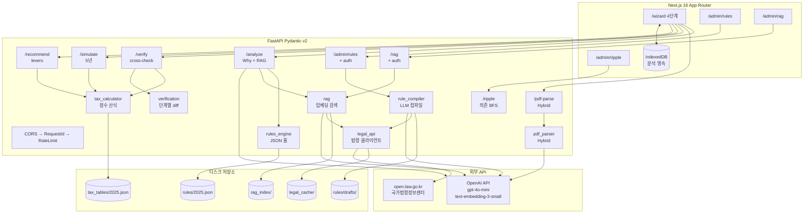

<div align="center">

# SUSEMI — AI 기반 연말정산 WHY 리포트

### **기획 → 디자인 → 프론트 → 백엔드 → AI 분석 → 배포까지 단독 개발**
### **자체 세금 산식 · 룰 컴파일러 · 법령 RAG · 의존성 그래프 · Admin 인증 · Rate Limit**


<br/>


<br/>


<br/><br/>

**사용자 맞춤형 연말정산 "WHY" 리포트 — 숫자가 아니라 _이유_ 를 알려주는 도구**
**PDF 파싱 → 세법 Rule Engine → AI 분석 → 자체 산식 cross-check → 5년 시뮬 → 추천**
**모든 결정세액에 _법령 조항 ID + 적용 공식_ 이 따라옴 (Provenance trace)**

</div>

---

## 왜 만들었는가

> **"왜 내 환급액이 이 금액이야?" — 이 질문에 답해 주는 서비스가 없었습니다.**

매년 1~2월, 수천만 근로소득자가 연말정산을 합니다.
국세청 간소화 서비스는 **합계 숫자만** 보여주고, 회사 담당자는 **"그냥 서류 내세요"** 라고 합니다.
왜 환급이 이만큼인지, 더 받을 수 있는 건 없는지, 어떤 법령이 적용된 건지 — **아무도 설명해 주지 않습니다.**

그런데 실제로 공제 항목을 들여다보면 생각보다 복잡합니다.
신용카드 하나만 해도:

| 결제수단 | 공제율 |
|---|---|
| 신용카드 | **15%** |
| 체크카드 / 현금영수증 | **30%** |
| 전통시장 | **40%** |
| 대중교통 | **40%** |
| 도서 / 공연 / 영화 등 문화비 | **30%** (총급여 7천만 이하) |

같은 10만원을 써도 **신용카드로 쓰면 15,000원, 전통시장에서 쓰면 40,000원** 공제됩니다.
총급여의 25%를 넘겨야 공제가 시작되는데, 이때 **낮은 공제율(신용카드)부터 차감**하는 순서 규칙도 있습니다.
기본 공제한도(300만/250만) 외에 전통시장+대중교통 추가한도(300만/200만)도 별도로 있습니다.

의료비는 총급여 3% 초과분만, 기부금은 정치자금/법정/지정 각각 세율이 다르고,
월세는 세대주+무주택+임대차계약 3개를 동시에 충족해야 합니다.

**이 모든 조건과 계산을 사람이 직접 확인하는 것은 사실상 불가능합니다.**
담당자도 모든 직원의 상황을 일일이 설명해 줄 수 없고,
세무사에게 상담받자니 비용과 시간이 부담됩니다.

**SUSEMI는 이 문제를 해결합니다.**

PDF 한 장 올리면 AI가 **법령 조항을 직접 인용하면서, 왜 이 결과가 나왔는지 단계별로** 설명합니다.
자체 세금 산식으로 회사 신고와 cross-check 하고, 더 받을 수 있는 공제가 있으면 구체적인 금액과 함께 알려줍니다.
결제수단별 공제율 차이, 전통시장 추가한도, 의료비 최저한 미달 금액까지 — **"왜"를 숫자와 법령으로 증명**합니다.

---

## SUSEMI가 분석하는 공제 항목 (2025년 귀속)

SUSEMI의 WHY 리포트는 아래 모든 항목의 세부율/한도/조건을 인지하고 분석합니다.

### 신용카드 등 소득공제 (조세특례제한법 §126의2)

| 결제수단 | 공제율 | 비고 |
|---|---|---|
| 신용카드 | 15% | |
| 체크카드 / 현금영수증 | 30% | 신용카드 대비 **2배** |
| 전통시장 | 40% | 추가한도 별도 |
| 대중교통 | 40% | 추가한도 별도 |
| 도서 / 공연 / 영화 등 문화비 | 30% | 총급여 7천만 이하만 |

- 최저사용금액: 총급여의 **25%** 초과분부터 공제
- 기본한도: 7천만 이하 **300만원** / 초과 **250만원**
- 추가한도 (전통시장+대중교통+문화비): 7천만 이하 **300만원** / 초과 **200만원**
- 공제 순서: 신용카드(15%) → 체크카드(30%) → 문화비(30%) → 전통시장/대중교통(40%)

### 의료비 세액공제 (소득세법 §59의4 ②)

| 구분 | 공제율 | 한도 |
|---|---|---|
| 일반 의료비 | 15% | 부양가족 연 700만원 |
| 난임시술비 | **30%** | 한도 없음 |
| 미숙아 / 선천이상 | **20%** | 한도 없음 |
| 본인 / 65세이상 / 장애인 / 6세이하 | 15% | **한도 없음** |

- 최저한: 총급여의 **3%** 초과분부터 공제
- 안경 / 콘택트렌즈: 1인당 연 **50만원** 한도
- 산후조리원: 출산 1회당 **200만원** (2025년~ 소득제한 폐지)
- 라식/라섹, 보청기, 임플란트도 공제 대상

### 교육비 세액공제 (소득세법 §59의4 ③)

| 대상 | 한도 (1인당) | 공제율 |
|---|---|---|
| 본인 | **한도 없음** | 15% |
| 취학전 아동 | 300만원 | 15% |
| 초 / 중 / 고등학생 | 300만원 | 15% |
| 대학생 | 900만원 | 15% |
| 장애인 특수교육 | **한도 없음** | 15% |

- 교복 / 체육복: 1인 **50만원** 한도 (간소화 미반영, 영수증 직접 제출)
- 취학전 학원비 (주 1회 이상 교습): 태권도, 미술, 피아노 등 포함

### 보험료 세액공제 (소득세법 §59의4 ①)

| 구분 | 공제율 | 한도 |
|---|---|---|
| 일반 보장성 보험 | **12%** | 연 100만원 |
| 장애인전용 보장성 보험 | **15%** | 연 100만원 (별도) |

### 연금저축 / IRP 세액공제 (소득세법 §59의3)

| 구분 | 한도 |
|---|---|
| 연금저축 단독 | 연 **600만원** |
| 연금저축 + IRP 합산 | 연 **900만원** |

| 총급여 | 공제율 (지방세 포함) |
|---|---|
| 5,500만원 이하 | **16.5%** |
| 5,500만원 초과 | **13.2%** |

- 최대 환급: 900만 x 16.5% = **148.5만원**
- 12월 중순까지 납입 완료 권장

### 월세 세액공제 (조세특례제한법 §95의2)

| 총급여 | 공제율 |
|---|---|
| 5,500만원 이하 | **17%** |
| 5,500만 ~ 8,000만원 | **15%** |
| 8,000만원 초과 | 공제 불가 |

- 한도: 연 **1,000만원** (2024년~ 상향)
- 요건: 무주택 세대주(원) + 85㎡ 이하 또는 기준시가 4억 이하
- 필요 서류: 임대차계약서, 주민등록등본, 월세 이체 증빙

### 기부금 세액공제 (소득세법 §59의4 ④)

| 유형 | 공제율 | 한도 |
|---|---|---|
| 정치자금 10만원 이하 | **100/110 (≈90.9%)** | 근로소득 전액 |
| 정치자금 10만~3천만원 | 15% | |
| 고향사랑 10만원 이하 | **100% + 답례품 3만원** | 2,000만원 |
| 법정 / 지정 기부금 | 1천만 이하 15%, 초과 30% | 소득의 30% |
| 종교단체 기부금 | 1천만 이하 15%, 초과 30% | 소득의 **10%** |

### 놓치기 쉬운 공제

| 항목 | 혜택 | 조건 |
|---|---|---|
| 중소기업 청년 소득세 감면 | **90% 감면**, 5년간 | 만 15~34세, 중소기업 취업 |
| 주택청약저축 소득공제 | 연 300만원 한도, **40%** | 총급여 7천만 이하 무주택 세대주 |
| 결혼세액공제 | 부부 각 **50만원** | 2024~2026 혼인신고, 생애 1회 |

---

## SUSEMI의 절세 추천 시스템 (5 Lever)

Greedy 추천 엔진이 사용자 상황에 맞는 **구체적 절세 전략**을 금액과 함께 제시합니다.

| 우선순위 | 추천 항목 | 예상 절세 | 실행 |
|---|---|---|---|
| 1 | 연금저축 600만원 채우기 | 최대 **99만원** | 12월 중순까지 납입 |
| 2 | IRP 추가 300만원 (합산 900만) | 추가 **49.5만원** | 12월 중순까지 납입 |
| 3 | 고향사랑기부금 10만원 | **13만원** (공제+답례품) | 고향사랑e음 사이트 |
| 4 | 정치자금 기부금 10만원 | **~9만원** 환급 | 선관위 사이트 |
| 5 | 월세 세액공제 신청 | 최대 **170만원** | 서류 준비만 하면 됨 |

그 외 WHY 리포트의 각 섹션 tips에서 제시하는 전략:

- **카드**: 연초에 신용카드로 25% 채우고 → 체크카드 전환(30%), 전통시장(40%) 적극 활용
- **의료비**: 맞벌이 부부는 낮은 소득 쪽에 몰아주기, 라식/라섹/보청기도 대상, 안경점 영수증 챙기기
- **교육비**: 교복/체육복 영수증 직접 제출 (간소화 미반영), 취학전 학원비도 공제
- **월세**: 현금영수증 발급 신청 가능 (집주인 동의 불요), 확정일자 받아두기
- **기부금**: 고향사랑 10만원 = 10만원 환급 + 3만원 답례품, 정치자금 10만원 = ~9만원 환급

---

## 무엇이 다른가

| | 국세청 간소화 / 회사 안내 | **SUSEMI** |
|---|---|---|
| 결과 | 합계 숫자만 | **숫자 + 법령 조항 + 적용 공식 + 판정 이유** |
| 설명 | "그냥 서류 내세요" | **"총급여 3,300만원의 25%인 825만원을 넘겨야 하는데, 신용카드 15% + 체크카드 30% 각각 공제됩니다"** |
| 법령 인용 | 없음 | **조세특례제한법 §126의2, 소득세법 §59의4 등 실제 조문 인용** |
| 카드 공제 | 합계만 | **결제수단별 공제율(15%/30%/40%) + 전통시장 추가한도 + 공제 순서까지** |
| 산식 | 블랙박스 | **자체 정수(원 단위) 한국 소득세 계산기** + 회사 신고 단계별 cross-check |
| 절세 조언 | 없음 | **"체크카드로 전환하면 공제율 2배, 전통시장 40% 추가한도 활용"** 등 구체적 전략 |
| What-if | 없음 | **5 lever marginal effect ranking + 5년 누적 시뮬** |
| 룰 추가 | 매년 코드 수정 | **법령 본문 → LLM 컴파일 → 검수 큐 → production** |

---

## 주요 기능

### 1. AI Why 분석 엔진 (`POST /api/v1/analyze`)

- 단순 요약이 아닌 **원인 기반 Reasoning (Explainable AI)**
- Rule Engine 평가 + RAG 법령 본문 + **자체 세금 산식 결과** + GPT-4o-mini 결합
- 5단계 분석 구조 강제: **법적 근거 인용 → 수치 대입 → 판정 → 절세 시뮬레이션 → 실행 전략**
- 시스템이 평가한 룰만 `[rule_id]` anchor로 인용 → **hallucination 차단**
- **결제수단별 공제율 차이**(신용카드 15% / 체크카드 30% / 전통시장 40%)를 분석에 반영
- 실제 결정세액 / 환급 / 추징 금액을 LLM에 주입 → **"의료비 28만원만 더 쓰면 15%인 4.2만원 절세"** 수준의 구체성
- `_attach_provenance(sections, evaluations)` 후처리로 모든 섹션에 법령 출처 부착
- LLM 응답은 변경하지 않고 새 Section 객체로 복제 (immutable 패턴)

### 2. 국세청 PDF 자동 파싱 — Hybrid Pipeline (`POST /api/v1/pdf-parse`)

한국 연말정산 간소화 PDF는 포맷이 일정하지 않아 정규식만으로 한계.
SUSEMI 의 **Hybrid Parsing**:

```
PDF Binary
  → PyMuPDF 텍스트 추출 (15,000자 컷)
  → GPT-4.1-mini 기반 텍스트 분석 + JSON 구조화
  → Pydantic 후처리 (normalize_int / normalize_tax_credit_type / missing_fields)
  → ParsedPdfData + missing_fields 반환
```

- 포맷이 살짝 달라도 LLM 이 문맥으로 흡수
- 누락 항목을 `missing_fields` 로 자동 추천
- 음수 값 clamping, 비현실적 큰 값 거부, 문자열 금액 파싱 (`"1,234,567 원"` → `1234567`)
- LLM 응답 실패 시 안전한 기본값 + `missing_fields=["llm_parse_error"]` 반환 (예외 안 던짐)
- lazy init — OPENAI_API_KEY 없어도 import 가능
- **37개 테스트**: normalize_int 13 parametrized + tax_credit_type 7 + missing_fields 3 + validation 5 + parse 9

### 3. 자체 세금 산식 — 한국 소득세 풀 파이프라인 (`tax_calculator.py`)

**총급여 → 근로소득공제 → 인적공제 → 과세표준 → 누진세율 → 산출세액 → 세액공제 → 결정세액 → 지방소득세 → 환급/추징**

- **정수(원 단위)** — 부동소수점 누적 오차 완전 회피
- 모든 단계가 `CalcStep(name, label, legal_anchor, formula, inputs, output)` 으로 trail
- 세율표 / 공제율은 100% **외부 JSON** (`data/tax_tables/2025.json`) — 코드 수정 없이 연도별 갱신
- 항목별 정밀 산식 (Tier 3-3):
  - **자녀세액공제**: 기본 (1명 15만 / 2명 30만 / 3명+ 30만+추가 30만씩) + 출산입양 (첫째 30만 / 둘째 50만 / 셋째+ 70만)
  - **의료비 세액공제**: 총급여 3% 초과분 × 15%, 일반 의료비 연 700만 한도
  - **기부금 세액공제**: 정치자금 (10만 이하 100/110, 10만 초과 15%, 3천만 초과 25%) + 일반 기부금 (1천만 이하 15%, 초과 30%, 근로소득 30% 한도)
- `compute_itemized` — 항목별 산식 합산, 0원 항목 자동 skip
- **55개 테스트**: 근로소득공제 7 + 누진세율 6 + 인적공제 3 + 근로소득세액공제 3 + 골든셋 10 + 자녀세액공제 9 + 의료비 3 + 기부금 6 + 항목별 합산 5 + 단계 검증 3

### 4. 회사 신고 단계별 cross-check (`POST /api/v1/verify`)

원천징수영수증의 결정세액 / 기납부세액을 입력하면 자체 산식 결과와 **단계별로** 비교.

- `tax_calculator.calculate(...)` 결과 vs 사용자 제공 `CompanyFiling` 단계별 비교
- severity 4단계: `match` / `minor` (<1,000원 반올림 차이) / `major` / `missing`
- **단정 표현 금지** — `"오류"`, `"잘못"` 단어 테스트로 차단. `"확인 필요"` 톤
- `local_income_tax` 누락 시 결정세액 x 10% 자동 추정
- 환급액이 더 받을 수 있으면 emerald, 추징이면 red
- **8개 테스트**: severity 분류 + self-consistent + major/minor diff + missing + local_tax 추정 + 환급 부호 + legal_anchor

### 5. 5년 What-if 시뮬레이션 (`POST /api/v1/simulate`)

- baseline + `YearOverride` 리스트 (max 10년)
- **carry-forward** — `None` 필드는 직전 연도 값 자동 상속
- 결혼 / 자녀 / 승진 같은 life event 시점부터 자동 적용
- 연도별 환급/추징 + 누적 집계 (cumulative aggregates)
- Pydantic `ge=0` — 음수 총급여 스키마 단에서 거부
- **9개 테스트**: baseline only + salary 인상 + 5년 carry-forward + 부양가족 추가 + 누적 집계 + override chain + 기납부세액 + 음수 거부 + 추가공제

### 6. Greedy 추천 — What-if 5 lever (`POST /api/v1/recommend`)

| Lever | 한도 | 공제율 | 설명 |
|---|---|---|---|
| 연금저축 | **600만** | 16.5% / 13.2% | 12월 중순까지 납입 |
| IRP | 합산 **900만** | 16.5% / 13.2% | 연금저축+IRP 합산 한도 |
| 정치자금 기부 | 10만 | 100/110 | 사실상 전액 환급 |
| 고향사랑 기부 | 10만 | 100% + 답례품 3만 | 총 13만원 혜택 |
| 월세 세액공제 | **1,000만** | 17% / 15% | 세대주 + 무주택 + 임대차 |

- 각 lever: `eligibility(inputs, request)` → `(bool, note)` + `apply(inputs, request)` → 새 CalcInputs
- marginal effect 크기순 정렬 (delta 내림차순)
- 자격 미충족 = 미적격 (delta=0, 마지막 정렬)
- `cost_label` 로 사용자 부담 명시 — delta 만으로 오해 방지
- **9개 테스트**: 전체 lever 반환 + 정렬 + 월세 자격 3가지 + 미적격 순서 + 고소득 공제율 + delta 정확성 + delta cap

### 7. JSON Rule Engine (`rules_engine.py`)

- `EVAL_CONTEXT_FIELDS` — 룰이 참조 가능한 필드 화이트리스트 + 한국어 라벨
- `build_eval_context(...)` — 사용자 입력을 flat dict 로 평탄화
- `Rule.evaluator` 는 **discriminated union**: `ThresholdEvaluator` / `AllOfFlagsEvaluator`
- `ValueExpr` 는 `FieldRef` / `RatioOfField` / `SumOfFields` / `Constant`
- **`eval()` 사용 0줄** — 보안성 완전 확보
- legacy `RuleContext` (dataclass) 호환 + 새 `RuleEvaluation` (Pydantic) 둘 다 반환
- 현재 룰 3건: 카드 / 의료비 / 월세 (2025년 기준)
- **19개 테스트**: 룰 로드 + legal_anchor + ValueExpr 4종 resolve + threshold pass/fail/missing + flags all/one + eval_context + rule_context 4건 + evaluation anchor + legacy 호환

### 8. LLM 룰 컴파일러 + 검수 큐 (`rule_compiler.py` + `rule_drafts_store.py`)

**법령 본문 → LLM → Rule JSON → 검수 큐 → production 병합**

- 입력: 법령 본문 + 타깃 메타 (rule_id / title / anchor)
- **메타 강제 덮어쓰기** — LLM 응답 후 코드가 `rule_id/title/year/anchor/compiled_by` 강제 세팅
- 화이트리스트 검증 — `EVAL_CONTEXT_FIELDS` 외 필드 참조 시 confidence 디스카운트 + warning
- JSON 파싱 1차 + 1회 재시도 (messy JSON 복구)
- 드래프트 디스크 CRUD: `data/rules/drafts/{year}/{rule_id}.json`
- `_validate_rule_id` — `^[A-Za-z0-9_\-]+$` 화이트리스트, path traversal 차단
- approve = `rules/{year}.json` 에 병합 (동일 id 교체) + `load_rules.cache_clear()` + 드래프트 삭제
- reject = 드래프트 삭제
- **28개 테스트**: 컴파일러 12 (meta overwrite + flags + unknown field + messy JSON + retry + double failure + field refs + validate) + 드래프트 스토어 16 (CRUD + approve + reject + path traversal 4건 + safe id)

### 9. 법령 API 클라이언트 (`legal_api.py`)

- **국가법령정보센터 OPEN API** (`open.law.go.kr`) 연동
- 본문 조회: `lawService.do?OC=...&type=JSON&ID=...` (또는 MST=)
- 검색: `lawSearch.do?OC=...&query=...`
- 디스크 캐시: `legal_cache/{law_id}/{efYd}.json` — 네트워크 실패 시 캐시 fallback
- **`validate_freshness(...)`** — 명시적 재호출, sha256 비교, `is_stale` 채움
- **`_safe_path_component`** — path traversal 방어
- 응답 키 매핑은 `_parse_law_response` 에 격리
- 실 OC 키 검증 완료 (소득세법 조문 130개 / 1,511 청크)
- **11개 테스트**: cache miss/hit + article 조회/not found + chunk 분해 + anchor 포맷 + freshness 변경/미변경 + cache fallback + no cache 에러 + missing OC

### 10. 법령 RAG (`rag.py` + `POST /api/v1/rag/*`)

- 임베딩 모델: `text-embedding-3-small` (1536 dim, 다국어)
- 저장: `rag_index/{law_id}/{efYd}.json` 단위 `IndexedLawPack`
- 검색: 메모리 풀스캔 + cosine 유사도 + top-K
- **빈 인덱스 / 필터 후 후보 0개 → 임베딩 호출 자동 skip** (비용 / 안정성 최적화)
- `embed_fn` 인자 주입 가능 (테스트는 deterministic 매핑)
- `_safe_component` — path traversal 방어
- law_id / article_no 필터링
- **15개 테스트**: cosine 3건 + index 3건 + search 6건 + stats + path traversal + embedding count mismatch

### 11. Analyze-RAG 통합 (`analyze.py` 내부)

- `_build_rag_query(evaluations)` — 평가 결과에서 title + anchor 추출해 RAG 쿼리 조합
- `_fetch_rag_context(evaluations)` — RAG 검색 호출 + 에러 시 silent fallback (빈 리스트)
- `_format_rag_for_prompt(hits)` — 번호 매김 + 긴 텍스트 truncate
- `_build_prompt(...)` — RAG 블록 포함 프롬프트 조립
- **10개 테스트**: empty evaluations + query 조합 + search 호출 + fallback + format empty/truncate/numbering + prompt 포함/미포함

### 12. Ripple-Effect Simulator (`GET /api/v1/ripple/*`)

- 룰 evaluator 자동 분석 → `(field → rule_ids)` 매핑
- tax_calculator step DAG 는 `TAX_STEP_DEPS` 상수에 하드코딩 — 코드와 동기 유지
- `ripple(field)` = BFS 최단경로 (사이클 없는 DAG 가정)
- 노드 3종: `field` / `rule` / `step`. `rule` 은 leaf.
- "causal" 명명 회피 — **결정론적 정적 분석** 임을 명시
- 3개 엔드포인트: `GET /ripple/{field}` / `GET /ripple/graph` / `GET /ripple/fields`
- **14개 테스트**: 인덱스 구축 + step deps + orphan 검사 + ripple 5건 (total_salary, gross_salary, householder, extra_income, unknown) + self loop + graph 3건 + fields

### 13. 사용자 입력 검증 (Validation-only 라우터)

| 엔드포인트 | 역할 | 검증 |
|---|---|---|
| `POST /api/v1/user-input` | 기본 소득 + 부양가족 + 조건 | total_salary > 0 |
| `POST /api/v1/manual-input` | PDF 누락 항목 수동 입력 | 월세 있으면 monthly_rent > 0 |

- **서버 영속화 없음** — 검증만 수행, 데이터는 프론트에서 `/analyze` 로 재전달
- 응답: `status: "ok" | "error"` + optional message

### 14. Provenance Trace

- 모든 CalcStep에 `legal_anchor` (법령 조항 ID) 부착
- 모든 RuleEvaluation에 `legal_anchor` 부착
- analyze 응답의 각 Section에 `provenance` 트리 부착
- `SECTION_TO_RULE_IDS` — 섹션 ↔ 룰 정적 매핑
- 원본 sections 불변 — 새 객체로 복제 후 provenance 추가
- **5개 테스트**: card 평가 부착 + unknown section + missing rule skip + 전체 section 커버리지 + 원본 불변

---

## 보안

### Admin 인증 (`security.py`)

- 환경변수 `ADMIN_TOKEN` 으로 단일 공유 토큰 설정
- 요청 헤더 `X-Admin-Token` 으로 전달
- **`hmac.compare_digest()`** — timing attack 방어
- 에러 코드: `503` (토큰 미설정) / `401` (헤더 누락) / `403` (토큰 불일치)
- `Depends(require_admin_token)` 으로 라우터/엔드포인트 레벨 적용
- **9개 테스트**: env 없음 503 + 헤더 없음 401 + 틀린 헤더 403 + 정상 통과 + admin/rag 라우트 각각 검증

### Rate Limiting (`rate_limit.py` + slowapi)

LLM / 임베딩 호출이 있는 엔드포인트만 보호. 순수 계산 엔드포인트는 무제한.

| 상수 | 제한 | 적용 엔드포인트 |
|---|---|---|
| `LIMIT_LLM_USER` | 5/minute | `/analyze`, `/pdf-parse` |
| `LIMIT_LLM_ADMIN` | 10/minute | `/admin/rules/compile` |
| `LIMIT_EMBEDDING` | 30/minute | `/rag/search` |
| `LIMIT_INDEX` | 10/hour | `/rag/index` |

- 클라이언트 IP 기반 (`get_remote_address`, X-Forwarded-For 지원)

### 기타 보안 조치

| 위협 | 차단 |
|---|---|
| Path traversal | `rule_id`, `law_id`, `effective_date` 등 파일명 컴포넌트 화이트리스트 (`^[A-Za-z0-9_\-]+$`), `UnsafeIdError` raise |
| `eval()` injection | 룰 evaluator 는 Pydantic discriminated union. eval() 사용 0줄 |
| 시크릿 누출 | `.env*` gitignore + `.env.example` 만 화이트리스트 |
| LLM hallucination | 시스템 제공 `[rule_id]` anchor 만 인용. 룰 컴파일러 메타 강제 덮어쓰기 |
| 음수/잘못된 입력 | Pydantic `ge=0` 검증 (simulate, verify, recommend) |
| RAG 빈 인덱스 비용 | 후보 0이면 임베딩 호출 자동 skip |
| Body 파싱 사고 | slowapi + Pydantic body 동시 사용 시 `Body(...)` 명시 + TestClient 회귀 |

---

## 미들웨어 스택

`server/main.py` 에서 순서대로 등록:

1. **CORS** — `CORS_ORIGINS` 환경변수 (기본: `localhost:3000`, `127.0.0.1:3000`)
2. **RequestIdMiddleware** — `X-Request-ID` 헤더 할당/보존 + 모든 요청 로깅
3. **Rate Limit Exception Handler** — slowapi 429 응답 처리

---

## 시스템 아키텍처



---

## 테스트

```bash
cd server
python -m pytest tests/ -v
```

```
237 passed in 2.72s
```

| 모듈 | 테스트 파일 | 케이스 | 주요 검증 내용 |
|---|---|:---:|---|
| tax_calculator | `test_tax_calculator.py` | 55 | 근로소득공제 7 + 누진세율 6 + 인적공제 3 + EITC 3 + 골든셋 10 + 자녀세액공제 9 + 의료비 3 + 기부금 6 + 항목별 합산 5 + 단계 검증 3 |
| pdf_parser | `test_pdf_parser.py` | 37 | normalize_int 14 + tax_credit_type 7 + missing_fields 3 + validation 5 + parse 7 + empty 1 |
| rules_engine | `test_rules_engine.py` | 19 | 룰 로드 + ValueExpr 4종 + evaluator 3종 + eval_context + rule_context 4건 + anchor + legacy |
| rule_drafts_store | `test_rule_drafts_store.py` | 16 | CRUD + approve/reject + path traversal 4건 + safe id |
| rag | `test_rag.py` | 15 | cosine 3 + index 3 + search 6 + stats + path traversal + mismatch |
| dependencies | `test_dependencies.py` | 14 | 인덱스 + step deps + orphan + ripple 5건 + self loop + graph 3 + fields |
| rule_compiler | `test_rule_compiler.py` | 12 | meta overwrite + flags + unknown field + messy JSON + retry + failure + field refs + validate |
| legal_api | `test_legal_api.py` | 11 | cache miss/hit + article + chunks + freshness + fallback + errors |
| analyze_rag | `test_analyze_rag_integration.py` | 10 | rag_query + fetch + format + prompt 조립 |
| recommend | `test_recommend.py` | 9 | 전체 lever + 정렬 + 자격 3건 + 미적격 순서 + 공제율 + delta |
| simulate | `test_simulate.py` | 9 | baseline + salary + carry-forward + 부양가족 + 누적 + chain + prepaid + 음수 + 추가공제 |
| security | `test_security.py` | 9 | 503/401/403/200 + admin route 4건 + rag route |
| verification | `test_verification.py` | 8 | severity 분류 + self-consistent + major/minor + missing + local_tax + 환급 부호 + anchor |
| provenance | `test_provenance.py` | 5 | card 부착 + unknown section + missing rule + 커버리지 + 불변성 |
| body_parsing | `test_body_parsing.py` | 4 | compile endpoint + real body + rag search + validates body |
| golden_calibration | `test_golden_calibration.py` | 4 | 30M single + 50M family + 180M high income + 최소 1건 존재 |
| **합계** | **16 파일** | **237** | |

테스트 특징:
- **골든셋 calibration** — 수동 계산 검증된 시나리오로 산식 정확도 보장
- **mocked LLM/embedder** — 실 API 호출 없이 결정론적 테스트
- **MockTransport** — httpx 기반 법령 API 시뮬레이션
- **TestClient 통합 테스트** — 라우터 / 미들웨어 / body 파싱 회귀 검증
- **path traversal PoC** — `../../etc/passwd` 등 실제 공격 패턴으로 차단 검증
- **단정 표현 차단** — verification 응답에 `"오류"`, `"잘못"` 단어 포함 시 테스트 실패

---

## 실제 API 연동 검증 완료

| 외부 API | 검증 결과 |
|---|---|
| OpenAI Chat (`gpt-4o-mini`) | 정상 응답 |
| OpenAI Embedding (`text-embedding-3-small`) | 1536 dim 정상 |
| 국가법령정보센터 (`open.law.go.kr`) | 소득세법 조문 130개 반환 |

---

## 디렉터리 구조

```
susemi/
├── .env                                 # 환경변수 (gitignored)
├── CLAUDE.md                            # 코드 패턴 / 컨텍스트 / 작업 원칙
├── PLAN.md                              # 단계별 작업 로그 / 결정
│
├── client/                              # Next.js 16 + React 19 + Tailwind v4
│   ├── package.json
│   └── app/
│       ├── components/
│       │   ├── AppHeader.tsx           # 글자 로고 (수세미 scrubbing motif SVG)
│       │   ├── ui/                     # Button/Input/Card/Spinner/UploadArea
│       │   └── report/ReportLayout/    # Why 리포트 + provenance 트리 + [rule_id] anchor
│       ├── wizard/                     # 4단계 위저드 + 결과 페이지
│       │   ├── page.tsx                # state 컨트롤러 + 모바일/데스크 분기
│       │   ├── IntroStep/              # step 0 (이어서 보기 카드 포함)
│       │   ├── IncomeStep/             # step 1
│       │   ├── PdfStep/               # step 2
│       │   ├── ManualStep/            # step 3
│       │   └── ResultStep/            # step 4
│       │       ├── index.tsx
│       │       ├── VerifySection.tsx   # 회사 신고 cross-check
│       │       ├── SimulateSection.tsx # 5년 시뮬
│       │       └── RecommendSection.tsx# What-if 추천
│       ├── admin/                      # 검수자 UI (토큰 인증 필요)
│       │   ├── rules/                  # LLM 컴파일 + 검수 큐
│       │   ├── rag/                    # 법령 인덱싱 / 검색
│       │   └── ripple/                 # 의존 그래프 뷰어
│       ├── lib/
│       │   ├── api.ts                  # 백엔드 fetch 래퍼
│       │   ├── storage.ts             # IndexedDB CRUD + SSR 안전
│       │   └── types.ts               # 백엔드 스키마 미러
│       └── globals.css                 # @import "tailwindcss" + @theme inline 토큰
│
└── server/                              # FastAPI 0.121 + Pydantic v2
    ├── main.py                          # CORS + RequestId + 라우터 등록
    ├── requirements.txt                 # 의존성 고정
    ├── pytest.ini                       # asyncio_mode=auto
    └── app/
        ├── security.py                 # HMAC 토큰 인증 (X-Admin-Token)
        ├── rate_limit.py               # slowapi rate limit 상수 + limiter
        ├── routers/
        │   ├── analyze.py              # POST /analyze + RAG 통합
        │   ├── pdf_parse.py            # POST /pdf-parse (Hybrid)
        │   ├── verify.py               # POST /verify
        │   ├── simulate.py             # POST /simulate
        │   ├── recommend.py            # POST /recommend
        │   ├── dependencies.py         # GET /ripple/*
        │   ├── admin_rules.py          # POST compile, GET drafts, approve/reject
        │   ├── rag.py                  # POST /rag/index, /rag/search, GET /rag/stats
        │   ├── manual_input.py         # POST /manual-input (validation)
        │   └── user_input.py           # POST /user-input (validation)
        ├── schemas/                    # Pydantic v2 모델 (12 파일)
        │   ├── analysis_schema.py      # AnalyzeRequest/Response, Section.provenance
        │   ├── tax_calculator_schema.py# CalcInputs / CalcStep / CalcResult
        │   ├── rule_schema.py          # Rule + ValueExpr + Evaluator discriminated union
        │   ├── rule_draft_schema.py    # RuleDraft + Compile/Decide req/res
        │   ├── verification_schema.py  # CompanyFiling / StepDiff / VerificationReport
        │   ├── simulate_schema.py      # YearOverride / SimulateRequest/Response
        │   ├── recommend_schema.py     # Lever / Recommendation
        │   ├── dependencies_schema.py  # RippleNode / GraphNode / GraphEdge
        │   ├── rag_schema.py           # IndexedChunk / Search / Index req/res
        │   ├── legal_schema.py         # Law / LawArticle / LawChunk
        │   ├── pdf_schema.py           # ParsedPdfData
        │   └── manual_input_schema.py / user_input_schema.py
        ├── services/                   # 도메인 로직 (11 파일)
        │   ├── tax_calculator.py       # 정수 산식 + CalcStep trail
        │   ├── rules_engine.py         # JSON 로드 + 평가
        │   ├── rule_compiler.py        # LLM 컴파일 + 메타 강제
        │   ├── rule_drafts_store.py    # 디스크 CRUD + path traversal 차단
        │   ├── verification.py         # 단계별 diff
        │   ├── simulate.py             # YearOverride carry-forward
        │   ├── recommend.py            # 4 lever greedy
        │   ├── dependencies.py         # 정적 DAG + BFS
        │   ├── rag.py                  # 임베딩 + cosine
        │   ├── legal_api.py            # open.law.go.kr + 디스크 캐시
        │   ├── llm_client.py           # Why 생성 (gpt-4o-mini)
        │   └── pdf_parser.py           # PyMuPDF + LLM Hybrid
        ├── data/
        │   ├── rules/2025.json         # 룰 정의 (3건)
        │   ├── rules/drafts/{year}/    # LLM 컴파일 드래프트
        │   ├── tax_tables/2025.json    # 세율 / 공제표
        │   ├── legal_cache/            # 법령 API 캐시 (gitignored)
        │   └── rag_index/              # RAG 임베딩 (gitignored)
        └── tests/                      # 237 케이스 (2.7초)
            ├── test_tax_calculator.py       (55)
            ├── test_pdf_parser.py           (37)
            ├── test_rules_engine.py         (19)
            ├── test_rule_drafts_store.py    (16)
            ├── test_rag.py                  (15)
            ├── test_dependencies.py         (14)
            ├── test_rule_compiler.py        (12)
            ├── test_legal_api.py            (11)
            ├── test_analyze_rag_integration.py (10)
            ├── test_recommend.py            (9)
            ├── test_simulate.py             (9)
            ├── test_security.py             (9)
            ├── test_verification.py         (8)
            ├── test_provenance.py           (5)
            ├── test_body_parsing.py         (4)
            ├── test_golden_calibration.py   (4)
            └── fixtures/                    # mock 데이터
```

---

## API 전체 목록

### 사용자 엔드포인트

| Method | Path | 역할 | Rate Limit |
|---|---|---|---|
| POST | `/api/v1/user-input` | 기본 소득 + 부양가족 검증 | - |
| POST | `/api/v1/pdf-parse` | PDF Hybrid Parsing | 5/min |
| POST | `/api/v1/manual-input` | 수동 입력 항목 검증 | - |
| POST | `/api/v1/analyze` | Rule Engine + RAG + LLM Why 분석 | 5/min |
| POST | `/api/v1/verify` | 자체 산식 vs 회사 신고 cross-check | - |
| POST | `/api/v1/simulate` | 5년 What-if 시뮬레이션 | - |
| POST | `/api/v1/recommend` | 4 lever marginal effect ranking | - |
| GET | `/api/v1/ripple/{field}` | 입력 변경 시 영향받는 룰/단계 BFS | - |
| GET | `/api/v1/ripple/graph` | 전체 의존성 그래프 | - |
| GET | `/api/v1/ripple/fields` | 전체 입력 필드 목록 | - |

### Admin 엔드포인트 (`X-Admin-Token` 필요)

| Method | Path | 역할 | Rate Limit |
|---|---|---|---|
| POST | `/api/v1/admin/rules/compile` | 법령 → LLM 룰 JSON 드래프트 | 10/min |
| GET | `/api/v1/admin/rules/drafts` | 드래프트 목록 | - |
| GET | `/api/v1/admin/rules/drafts/{year}/{rule_id}` | 드래프트 상세 | - |
| POST | `/api/v1/admin/rules/drafts/{year}/{rule_id}/approve` | 드래프트 승인 → production 병합 | - |
| POST | `/api/v1/admin/rules/drafts/{year}/{rule_id}/reject` | 드래프트 거부 → 삭제 | - |
| POST | `/api/v1/rag/index` | 법령 청크 임베딩 인덱싱 | 10/hr |
| POST | `/api/v1/rag/search` | 자연어 → top-K 법령 청크 | 30/min |
| GET | `/api/v1/rag/stats` | RAG 인덱스 통계 | - |

---

## 진행도

| Phase | 내용 | 상태 |
|:---:|---|:---:|
| 1 | UI 리디자인 (slate + yellow) | Done |
| 2-1 | 환급액 산식 + 골든셋 | Done |
| 2-2 | 룰 JSON 외부화 | Done |
| 2-3 | IndexedDB 클라 영속 | Done |
| 2-4 | 법령 API 클라이언트 | Done |
| 3-1 | Provenance trace | Done |
| 3-2 | LLM 룰 컴파일러 + 검수 | Done |
| 3-3 | 회사 신고 cross-check | Done |
| 3-3+ | 항목별 정밀 산식 (자녀/의료비/기부금) | Done |
| 4-1 | 다년도 What-if 시뮬 | Done |
| 4-2 | 법령 RAG | Done |
| 4-3 | Greedy 추천 | Done |
| 4-4 | 의존성 그래프 (ripple) | Done |
| 4-5 | Admin 인증 (HMAC 토큰) | Done |
| 4-6 | Rate Limiting (slowapi) | Done |
| 4-7 | Analyze-RAG 통합 | Done |
| 4-8 | Body 파싱 회귀 방어 | Done |
| 4-9 | Golden Calibration 프레임 | Done |
| 5 | WASM / ILP / KG / FL | 트리거 시 |

자세한 단계별 작업 로그: **[PLAN.md](./PLAN.md)** / 코드 패턴 / 컨텍스트: **[CLAUDE.md](./CLAUDE.md)**

---

## 실행 방법

### 1. 환경변수

프로젝트 루트에 `.env` 파일 생성:

```bash
# OpenAI API (analyze, pdf-parse, rag, rule_compiler)
OPENAI_API_KEY=sk-...

# 국가법령정보센터 OPEN API (open.law.go.kr OC 키)
OPEN_LAW_API_KEY=...

# Admin 엔드포인트 인증 토큰
ADMIN_TOKEN=your-secret-token

# CORS 허용 Origin (선택, 기본: localhost:3000)
CORS_ORIGINS=http://localhost:3000
```

### 2. Backend (FastAPI)

```bash
cd server
python -m venv venv

# Windows
venv\Scripts\activate
# macOS/Linux
source venv/bin/activate

pip install -r requirements.txt
uvicorn main:app --reload    # → http://localhost:8000
```

### 3. Frontend (Next.js 16)

```bash
cd client
npm install
npm run dev                  # → http://localhost:3000 → /wizard
```

### 4. 테스트

```bash
cd server
python -m pytest tests/ -v   # 237 passed in 2.7s
```

---

## 기술 스택

### Frontend
- **Next.js 16.0.3** (App Router) + React 19.2 + Tailwind CSS v4
- TypeScript 5 strict + ESLint 9
- `lucide-react` 아이콘 + IndexedDB 직접 사용 (의존성 0)
- 반응형 Wizard + Admin UI 모두 자체 컴포넌트

### Backend
- **FastAPI 0.121.3** + Uvicorn + Starlette 0.50
- **Pydantic v2.12** (discriminated union, ge/pattern 검증)
- `httpx` 0.28 async + `openai` 2.8 SDK + `PyMuPDF` 1.26
- `slowapi` 0.1.9 (rate limiting)
- `python-dotenv` 1.2
- **`pytest` 8.3 + `pytest-asyncio` 0.25** (asyncio_mode=auto)

### External API
- **OpenAI**: `gpt-4o-mini` (분석 / 룰 컴파일) + `gpt-4.1-mini` (PDF 파싱) + `text-embedding-3-small` (RAG 1536 dim)
- **국가법령정보센터 OPEN API**: 법령 본문 + 시행일자 변경 감지 + 디스크 캐시

---

## Technical Highlights

- **한국 간소화 PDF → GPT Hybrid Parsing** 직접 구현 (정규식 한계 회피 + 안전 기본값)
- 자체 한국 소득세 풀 산식 — 정수 기반, 항목별 정밀 산식 (자녀/의료비/기부금), 골든셋 검증
- **Provenance trace** — 모든 결정세액에 법령 anchor + 공식 + 단계 trail
- LLM 룰 컴파일러 + human-in-the-loop 검수 큐 (메타 강제 덮어쓰기)
- 법령 API 디스크 캐시 + sha256 변경 감지 → 자동 재컴파일 트리거 가능
- Analyze-RAG 통합 — 룰 평가 결과 기반 자동 법령 검색 + 프롬프트 삽입
- Ripple-Effect Simulator — 룰/step 정적 DAG + BFS
- **HMAC timing-safe 토큰 인증** + slowapi IP 기반 rate limiting
- **path traversal PoC → 화이트리스트 fix** + 회귀 테스트
- Pydantic discriminated union 으로 **`eval()` 사용 0줄** 룰 평가기
- Body 파싱 회귀 방어 — slowapi + Pydantic body 충돌 패턴 TestClient 검증
- Wizard UX + PC/모바일 분기 + 카카오페이톤 감성 UI 자체 구현
- **237 케이스 2.7초** — 16 테스트 파일, mocked LLM/embedder, MockTransport 활용

---

## 알려진 한계 (v2 백로그)

- 모든 시뮬 연도가 2025 세율표 사용 — per-year 세율표는 v2
- PDF 파서: 텍스트 PDF 만 지원, 이미지 OCR 없음
- RAG: 메모리 풀스캔 (수백 법령까지 OK), vector DB 미적용
- 항목별 정밀 산식 추가 여지: 보험료 / 교육비 / 연금저축 세액공제
- 골든셋 source 가 `hand_calculated` — 국세청 모의계산기 검증 후 갱신 필요
- Admin 인증: 단일 토큰 방식 — 멀티 유저 / 감사 로그는 v3

---

## Developer — 강지연

**Full-stack & AI Developer**

> "아이디어를 빠르게 제품으로 만드는 개발자"

- 기획 → 설계 → 개발 → 배포 단독 수행
- 프론트 / 백엔드 / AI / 보안 모두 직접 구현
- 세무 / 회계 실무 경험 → Rule Engine 정확도 강화
- 4일 만에 MVP → 자체 산식 / 검증 / 시뮬 / RAG / 룰 컴파일러 / 인증 / Rate Limit 까지 단독 확장

---

## License

미정.

---

<div align="center">

**SUSEMI** — 환급액에 _법령 조항이 따라옵니다_.

</div>
